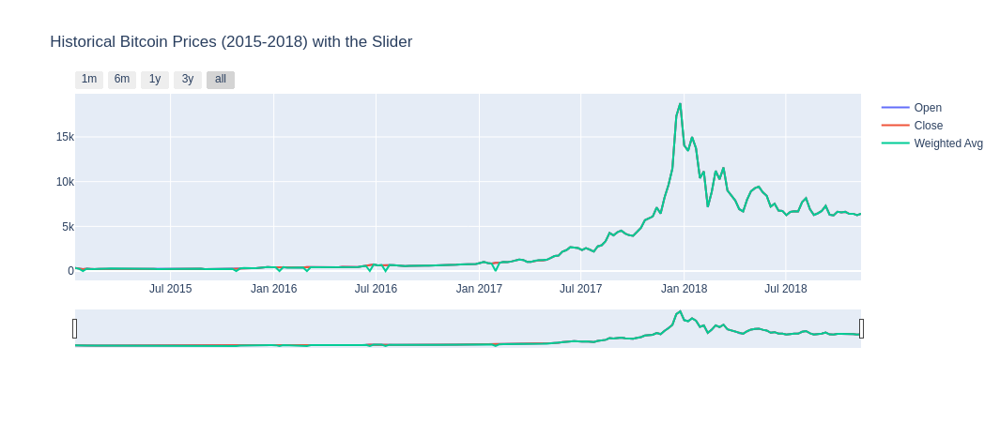
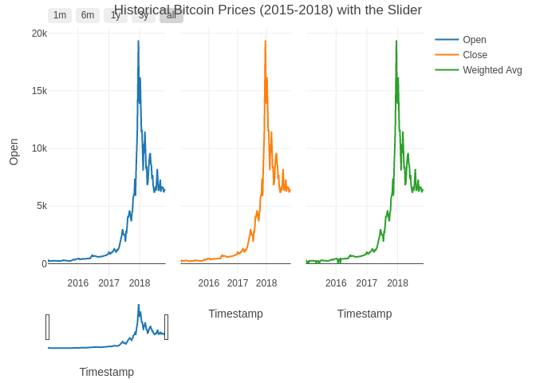
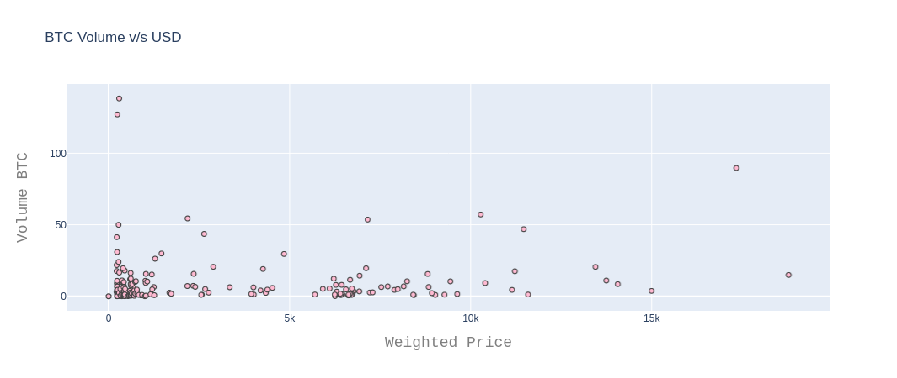
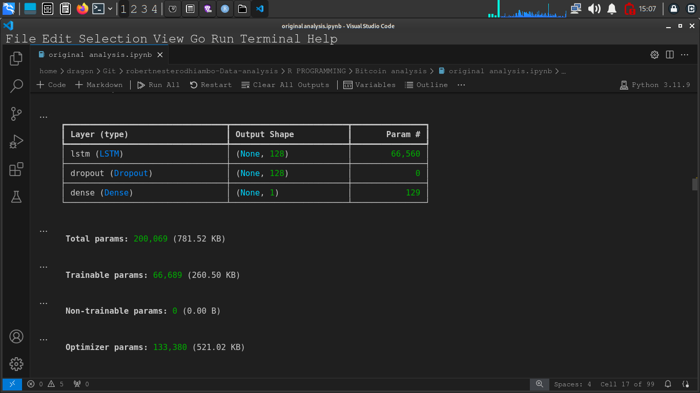
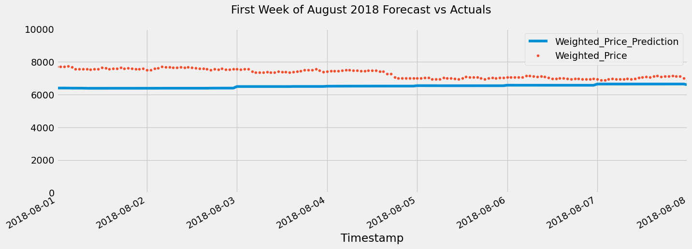

# BITCOIN

------------------------------------------------------------------------

Bitcoin, introduced in 2009 by the mysterious Satoshi Nakamoto, stands as the pioneering cryptocurrency.
It operates on a decentralized peer-to-peer network, allowing secure and transparent transactions without the need for a central authority.
Bitcoin's blockchain technology records every transaction in a public ledger, ensuring immutability and trustworthiness through cryptographic hashing.

Our project is structured into two key sections:

**1. Data Exploration** - Analyzing and visualizing Bitcoin price data.
- Identifying trends and patterns in historical price movements.

**2. Time Series Analysis and Forecasting** - **Forecasting Methods:** - **LSTM (Long Short-Term Memory):** Leveraging deep learning to capture complex temporal dependencies.
- **XGBoost:** Harnessing gradient boosting to predict Bitcoin price fluctuations.
- **Facebook Prophet:** Using a versatile tool for forecasting with seasonality and holidays.
- **ARIMA (AutoRegressive Integrated Moving Average):** Employing a traditional statistical approach for time series forecasting.

This project draws inspiration from notable kernels and tutorials, including those focused on Prophet, XGBoost, and ARIMA models, tailored specifically for Bitcoin price prediction.

For those new to Bitcoin, you can learn more about its fundamentals [here](https://www.coindesk.com/information/what-is-bitcoin).

------------------------------------------------------------------------

# Checking out the dataset in my data folder

From the code below we set a default data folder and we run the code and it lists the data files in the folder, for our case its

-   "bitstampUSD_1-min_data_2012-01-01_to_2018-11-11.csv"

This file has the daily data from 2012 first January to 2018 eleventh November hourly makret prices for BTC

-   "coinbaseUSD_1-min_data_2014-12-01_to_2018-11-11.csv"

This file has the daily data from 2014 first January to 2018 eleventh November hourly market prices for BTC

```{r, message=FALSE}
# Set the directory path where the data is located
data_dir <- "~/Git/Data"

# List files in the directory specified by data_dir
dir_contents <- list.files(data_dir)

# Print the contents of the directory to the console
print(dir_contents)

```

# Environment preparation

## Getting packages

```{r, message=FALSE}
# Define the list of package names
packages <- c("tidyverse", "plotly", "lubridate", "readr", "dplyr", "zoo", "ggplot2", "forecast", "stats", "tseries")
# Use lapply to load each package
lapply(packages, require, character.only = TRUE)
```

## Data importation

-   **The data importation utilizes read_csv function from readr library. our Data ahas a Timestamp which will be converted to readable from with the code line `mutate(Timestamp = as.POSIXct(Timestamp, origin = "1970-01-01", tz = "UTC"))`**

-   the line interprates the Timestamp to human readable form.
    We set the format to UTC then give it a sample date to use like in our case 1970-01-01.
    and set the path to our file

-   here we end the code by displaying the first 6 rows of data

```{r, message=FALSE}
# Define a function to parse timestamps from seconds since the Unix epoch
dateparse <- function(time_in_secs) {
  as_datetime(as.numeric(time_in_secs), origin = "1970-01-01", tz = "UTC")
}

# Expand the tilde to the home directory and specify the file path
file_path <- "~/Git/Data/coinbaseUSD_1-min_data_2014-12-01_to_2018-11-11.csv"

# Read the CSV file into a data frame named 'data'
data <- read_csv("~/Git/Data/coinbaseUSD_1-min_data_2014-12-01_to_2018-11-11.csv")

# Convert the 'Timestamp' column from numeric Unix timestamps to POSIXct date-time objects
data <- data %>%
  mutate(Timestamp = as.POSIXct(Timestamp, origin = "1970-01-01", tz = "UTC"))

# Display the first few rows of the 'data' data frame
head(data)

```

### Summary statistics

The summary statistics diplays the minimum value and maximum value which explains the range.
the 1st median meand and third quartile range are also in play they elaborate the interquartile ranges.
the summary also highlights the total number of missing variables in each columns.

```{r}
summary(data)
```

## Data Cleaning

### handling missing values

-   From the code below we fill missing values in Open High Low and Close columns and replace NAs with zero in Volume columns

```{r}
# Fill NA values with zeroes for volume/trade-related fields using dplyr's mutate function
data <- data %>%
  mutate(`Volume_(BTC)` = ifelse(is.na(`Volume_(BTC)`), 0, `Volume_(BTC)`),  # Replace NA with 0 in 'Volume_(BTC)'
         `Volume_(Currency)` = ifelse(is.na(`Volume_(Currency)`), 0, `Volume_(Currency)`),  # Replace NA with 0 in 'Volume_(Currency)'
         Weighted_Price = ifelse(is.na(Weighted_Price), 0, Weighted_Price))  # Replace NA with 0 in 'Weighted_Price'

# Fill forward NA values (last observation carried forward) for OHLC data using zoo's na.locf function
data$Open <- zoo::na.locf(data$Open)    # Fill NA values in 'Open' column
data$High <- zoo::na.locf(data$High)    # Fill NA values in 'High' column
data$Low <- zoo::na.locf(data$Low)      # Fill NA values in 'Low' column
data$Close <- zoo::na.locf(data$Close)  # Fill NA values in 'Close' column

# Convert 'Timestamp' column from numeric Unix timestamps to POSIXct date-time objects in UTC timezone
data <- data %>%
  mutate(Timestamp = as.POSIXct(Timestamp, origin = "1970-01-01", tz = "UTC"))

# Display the first few rows of the updated data frame 'data'
head(data)


```

### Getting weekly data

-   the code below groups the data by weeks where we create weekly groupings of every 7 days from the date `2015-01-01 00:00:00` to `2018-11-11 00:00:00`. after this we display the weekly data created and stored as weekly_rows

```{r}
# Create valid date range
start <- ymd_hms("2015-01-01 00:00:00", tz = "UTC")  # Define start date-time in UTC timezone
end <- ymd_hms("2018-11-11 00:00:00", tz = "UTC")    # Define end date-time in UTC timezone

# Find rows between start and end time in 'data' dataframe
filtered_data <- data %>%
  filter(Timestamp >= start & Timestamp <= end)  # Filter data for rows with Timestamp between 'start' and 'end'


# Find the first row of each week (starting on Monday) in filtered_data
weekly_rows <- filtered_data %>%
  mutate(Week = floor_date(Timestamp, unit = "week", week_start = 1)) %>% # Create 'Week' column by flooring Timestamp to the nearest week starting on Monday
  group_by(Week) %>%        # Group rows by 'Week' column
  slice(1) %>%               # Select the first row from each group (week)
  ungroup()                  # Remove grouping for further operations

# Display the first few rows of weekly_rows data frame
head(weekly_rows)

```

## Visualization

### Lets visualize Historical Bitcoin Market Volume (2015-2018)-Yearly

in this code below we utilize plotly function from plotly package to create an interactive plot.
the interactive plot takes in arguments of lable for 1month 6month and 12months to make the widgets more interactive.

#### Comparson of the python plot and R plot





The python output does not distinguish the open closed and weighted_price clearly in the plot.
Although ht plots interactively matches that of R programming, we see a superiority of the R language in handling the visualizations in a more vasetile manner by creating multiple facets for each column while still maintaining the same x and y axis.

the plots on the other hand show a rising trend in Bitcoin and a drop in 2018 on wards.

```{r}
# Create the traces for each line plot
trace1 <- plot_ly(data = weekly_rows, x = ~Timestamp, y = ~Open, type = 'scatter', mode = 'lines', name = 'Open')
trace2 <- plot_ly(data = weekly_rows, x = ~Timestamp, y = ~Close, type = 'scatter', mode = 'lines', name = 'Close')
trace3 <- plot_ly(data = weekly_rows, x = ~Timestamp, y = ~Weighted_Price, type = 'scatter', mode = 'lines', name = 'Weighted Avg')

# Combine the traces into a subplot with shared axes
fig <- subplot(trace1, trace2, trace3, nrows = 1, shareX = TRUE, shareY = TRUE)

# Update the layout of the plot with title, x-axis options, and range slider
fig1 <- fig %>% layout(
  title = 'Historical Bitcoin Prices (2015-2018) with the Slider',  # Set the title of the plot
  xaxis = list(
    rangeselector = list(
      buttons = list(
        list(count = 1, label = '1m', step = 'month', stepmode = 'backward'),  # Button for 1 month range
        list(count = 6, label = '6m', step = 'month', stepmode = 'backward'),  # Button for 6 months range
        list(count = 12, label = '1y', step = 'month', stepmode = 'backward'),  # Button for 1 year range
        list(count = 36, label = '3y', step = 'month', stepmode = 'backward'),  # Button for 3 years range
        list(step = 'all')  # Button for showing all data
      )
    ),
    rangeslider = list(visible = TRUE),  # Enable the range slider for zooming
    type = 'date'  # Set the type of x-axis to date
  )
)

# Plot the figure
fig1
```

### Lets visualize Historical Bitcoin Prices (2015-2018) - Monthly

this code functions exactly as the previous one, The plot shows a spike in prices every october - december for each year.
this can only be notice when hovering over the plots and the interactivity becomes active.

#### Comparison with python plot


.png)

These two plot are similar theought hence both languages would suit the job for this code.

```{r}
# Create the trace for Volume (Currency)
trace1 <- plot_ly(data = weekly_rows, x = ~Timestamp, y = ~`Volume_(Currency)`, type = 'scatter', mode = 'lines', name = 'Bitcoin Volume (USD)')

# Update layout with title, x-axis options, and range slider
fig2 <- trace1 %>% layout(
  title = 'Historical Bitcoin Volume (USD) (2015-2018) with the slider',  # Set the title of the plot
  xaxis = list(
    rangeselector = list(
      buttons = list(
        list(count = 1, label = '1m', step = 'month', stepmode = 'backward'),  # Button for 1 month range
        list(count = 6, label = '6m', step = 'month', stepmode = 'backward'),  # Button for 6 months range
        list(count = 12, label = '1y', step = 'month', stepmode = 'backward'),  # Button for 1 year range
        list(count = 36, label = '3y', step = 'month', stepmode = 'backward'),  # Button for 3 years range
        list(step = 'all')  # Button for showing all data
      )
    ),
    rangeslider = list(visible = TRUE),  # Enable the range slider for zooming
    type = 'date'  # Set the type of x-axis to date
  )
)

# Plot the figure
fig2
```

### BTC Volume

This is a BTC Volume plot where we see the relationship between the BTC volume and weighted price.
There is a cluster of Volumes at specific prices.

**History of Bitcoin Prices**

-   18 August 2008, the domain name bitcoin.org was registered.
-   November 6th 2010, Bitcoin share capital reaches 1 million USD. Its exchange rate on MtGox reaches USD 0.50 per BTC.
-   June 2nd 2011, USD to BTC rate is 10 USD to the coin. For 6 days, the Bitcoin value is fixed at 31.91 USD on MtGox.
-   February 28th 2013, Bitcoin exchange rate surpasses 31.91 USD for the first time for the last 601 days.
-   April 1st,2013 Exchange rate of Bitcoin reaches 100 USD to 1 BTC.
-   January,2015 Coinbase raised 75 million USD as part of a Series C funding round, smashing the previous record for a bitcoin company.
-   February ,2015 Bitcoin price reached USD 262.
-   January 2017,After the rally for most of the second half of 2016, bitcoin broke the USD 1,000 mark for the first time in 3 years.
-   June 12th 2017, Bitcoin exchange rate exceeds USD 3000 to the BTC.
-   November 29th 2017, Bitcoin price exceeds USD 10,000.
-   December 18th 2017, Bitcoin reaches a record high, but does not reach USD 20,000.
-   December 28th 2017, The price of bitcoins fell after South Korea announced additional measures to regulate bitcoin trading, including the potential closure of exchanges, among the volatile movements in the world's third largest cryptocurrency market.
-   October 31st 2018, USD 6,300, on the 10 year anniversary of Bitcoin, price holds steady above USD 6,000 during a period of historically low volatility.

#### comparison with python plot




These two plots are simmilar making both languages easier to handle for this kind of plot.

```{r}
library(plotly)     # Load the plotly package for interactive plots
library(dplyr)      # Load the dplyr package for data manipulation
library(lubridate)  # Load the lubridate package for handling date/time data

# Create the trace for BTC Volume vs USD
trace <- plot_ly(data = weekly_rows, x = ~Weighted_Price, y = ~`Volume_(BTC)`, 
                 type = 'scattergl', mode = 'markers', marker = list(color = '#FFBAD2', line = list(width = 1)))

# Update layout with title and axis labels
fig3 <- trace %>% layout(
  title = 'BTC Volume vs USD',  # Set the title of the plot
  xaxis = list(title = 'Weighted Price', titlefont = list(family = 'Courier New, monospace', size = 18, color = '#7f7f7f')),  # Set x-axis title and formatting
  yaxis = list(title = 'Volume BTC', titlefont = list(family = 'Courier New, monospace', size = 18, color = '#7f7f7f'))  # Set y-axis title and formatting
)

# Plot the figure
fig3
```

# Timeserires Forecasting

**Time Series Forecasting** An experimental set of data that has been seen at various times is called a time series (typically equally spaced, as once a day, once an hour, or once a minute).
A time series would be the daily sales data for airline tickets, for instance.
Dates of significant airline tragedies, for example, are not time series since they are arbitrarily spaced; they are just a collection of occurrences with a time component.
Point processes are a class of random processes.

Time series include seasonality, noise, and trend, among other important characteristics.The technique of predicting the future using data from the past and present is called forecasting.
Here in this kernel, we attempt to perform Time Series Analysis on the Historic Bitcoin Price data.
We can easily see from the **Data Exploration** section, that the Bitcoin prices were quite volatile and inconsistent over the years.
Its very hard to perform Time series analysis on such volatile data.
But here we try to explore the different Time series forecasting models.
All the models used in this Kernel are very basic, there is scope of more complex and better performing models.

-   Time Series forecasting with LSTM
-   Time Series forecasting with XGBoost
-   Time Series forecasting with Facebook Prophet
-   Time Series forecasting with ARIMA

## Prediction using LSTM

The Long Short-Term Memory (LSTM) model is a type of recurrent neural network (RNN) designed to capture long-term dependencies and manage the vanishing gradient problem that traditional RNNs often face.
Here's the mathematical formulation of the LSTM model:

### LSTM Components

1.  **Input Gate**:
    -   Input: $x_t$ (input at time step $t$)
    -   Previous hidden state: $h_{t-1}$
    -   Previous cell state: $c_{t-1}$
    -   Activation function: Sigmoid $\sigma$ and hyperbolic tangent $\tanh$
    -   Update: $$
        i_t = \sigma(W_i \cdot [h_{t-1}, x_t] + b_i)
        $$
2.  **Forget Gate**:
    -   Input: $x_t$, $h_{t-1}$
    -   Activation function: Sigmoid $\sigma$
    -   Update: $$
        f_t = \sigma(W_f \cdot [h_{t-1}, x_t] + b_f)
        $$
3.  **Cell State**:
    -   Input gate output: $i_t$
    -   Forget gate output: $f_t$
    -   Candidate cell state: $\tilde{c}_t$ (proposed cell state update)
    -   Update: $$
        \tilde{c}_t = \tanh(W_c \cdot [h_{t-1}, x_t] + b_c)
        $$ $$
        c_t = f_t \cdot c_{t-1} + i_t \cdot \tilde{c}_t
        $$
4.  **Output Gate**:
    -   Input: $x_t$, $h_{t-1}$
    -   Activation function: Sigmoid $\sigma$ and hyperbolic tangent $\tanh$
    -   Update: $$
        o_t = \sigma(W_o \cdot [h_{t-1}, x_t] + b_o)
        $$ $$
        h_t = o_t \cdot \tanh(c_t)
        $$

### Parameters

-   $W_i, W_f, W_c, W_o$: Weight matrices for input, forget, cell, and output gates, respectively.
-   $b_i, b_f, b_c, b_o$: Bias vectors for input, forget, cell, and output gates, respectively.
-   $[h_{t-1}, x_t]$: Concatenation of previous hidden state $h_{t-1}$ and current input $x_t$.

### Function Explanation

-   **Sigmoid Activation (σ)**: Scales input values between 0 and 1, controlling the flow of information through gates.
-   **Hyperbolic Tangent (tanh)**: Squashes input values between -1 and 1, regulating the cell state update and output.

### Data importaion

This segment is same as the previous codes

```{r, message=FALSE}
data <- read_csv("~/Git/Data/bitstampUSD_1-min_data_2012-01-01_to_2018-11-11.csv")  # Read CSV data into 'data' dataframe
data <- data %>% 
  mutate(Timestamp = as.POSIXct(Timestamp, origin = "1970-01-01", tz = "UTC"))  # Convert 'Timestamp' to POSIXct with UTC timezone

# Define a function to convert Unix timestamp to datetime with UTC timezone
dateparse <- function(time_in_secs) {
  as.POSIXct(time_in_secs, origin = "1970-01-01", tz = "UTC")
}

# Parse the 'Timestamp' column using 'dateparse' function
data <- data %>% 
  mutate(Timestamp = dateparse(Timestamp))

# Group by hour and take the first value in each group
data <- data %>% 
  mutate(Timestamp = floor_date(Timestamp, unit = "hour")) %>%  # Floor 'Timestamp' to the nearest hour
  group_by(Timestamp) %>%  # Group by 'Timestamp'
  slice(1) %>%  # Take the first row from each group
  ungroup() %>%  # Ungroup the data
  select(Timestamp, Weighted_Price)  # Select 'Timestamp' and 'Weighted_Price' columns

# Fill missing values in 'Weighted_Price' with the last available value
data <- data %>% 
  fill(Weighted_Price)  # Fill NA values in 'Weighted_Price' with the last non-NA value

# Print the first few rows of the dataframe
head(data)  # Display the first few rows of 'data'
```

**For the train and test, we take '25-Jun-2018' as the split date. There was a considerable dip in Bitcoin prices between the June-July period 2018. If we check the historical prices the seasonal market started going up from this date after reaching the lowest, though the price reached much lower \$5972 on June 29th 2018. After reaching the historic 20K mark on December 18th, there were several dips and market price was recorrected every time. Read more about [Bitcoin dips.](http://https://news.bitcoin.com/data-reveals-reasons-behind-bitcoins-big-dip/)**

```{r}
# Convert 'Timestamp' column to POSIXct with UTC timezone
data$Timestamp <- as.POSIXct(data$Timestamp, origin = "1970-01-01", tz = "UTC")

# Define the split date
split_date <- as.POSIXct("2018-06-25", tz = "UTC")

# Split data into training and testing sets
data_train <- data %>% 
  filter(Timestamp <= split_date) %>%  # Filter rows where Timestamp is less than or equal to split_date
  select(Timestamp, Weighted_Price) %>%  # Select Timestamp and Weighted_Price columns
  mutate(Timestamp = as.character(Timestamp))  # Convert Timestamp to character for writing to CSV

  data_test <- data %>% 
  filter(Timestamp > split_date) %>%  # Filter rows where Timestamp is greater than split_date
  select(Timestamp, Weighted_Price) %>%  # Select Timestamp and Weighted_Price columns
  mutate(Timestamp = as.character(Timestamp))  # Convert Timestamp to character for writing to CSV

# Print head of training and testing sets
head(data_train)  # Display the first few rows of 'data_train'
head(data_test)   # Display the first few rows of 'data_test'

```

```{r}
# Define the color palette
color_pal <- c("#F8766D", "#D39200", "#93AA00", "#00BA38", "#00C19F", "#00B9E3", "#619CFF", "#DB72FB")

# Plot using ggplot2
ggplot(data, aes(x = Timestamp, y = Weighted_Price)) +
  geom_line(color = color_pal[1]) +
  labs(title = "BTC Weighted_Price Price (USD) by Hours") +
  theme_minimal() +
  theme(plot.title = element_text(hjust = 0.5),
        axis.text.x = element_text(angle = 45, hjust = 1)) +  # Adjust x-axis text angle and alignment
  scale_x_datetime(date_labels = "%b %Y", date_breaks = "1 month")  # Customize x-axis date labels and breaks

# Save the plot with adjusted size and layout
ggsave("btc_price_plo0t.png", width = 12, height = 6, dpi = 300)  # Adjust width and height as needed


```

```{r, warning=FALSE}
# Convert 'Timestamp' to POSIXct for proper datetime handling
data_test$Timestamp <- as.POSIXct(data_test$Timestamp, origin = "1970-01-01", tz = "UTC")
data_train$Timestamp <- as.POSIXct(data_train$Timestamp, origin = "1970-01-01", tz = "UTC")

# Rename columns for clarity
data_test <- data_test %>% 
  rename(`Test Set` = Weighted_Price)  # Rename 'Weighted_Price' column in data_test to 'Test Set'

data_train <- data_train %>% 
  rename(`Training Set` = Weighted_Price)  # Rename 'Weighted_Price' column in data_train to 'Training Set'

# Join data_test and data_train
joined_data <- full_join(data_test, data_train, by = "Timestamp")  # Perform a full join on 'Timestamp'

# Plot using ggplot2
ggplot(joined_data, aes(x = Timestamp)) +  # Define x-axis as 'Timestamp'
  geom_line(aes(y = `Test Set`), color = "#F8766D") +  # Add line plot for 'Test Set' with specified color
  geom_line(aes(y = `Training Set`), color = "#D39200") +  # Add line plot for 'Training Set' with specified color
  labs(title = "BTC Weighted_Price Price (USD) by years") +  # Set plot title
  theme_minimal() +  # Apply minimal theme
  theme(plot.title = element_text(hjust = 0.5)) +  # Center the plot title
  xlab("Date") +  # Label x-axis
  ylab("Weighted Price (USD)")  # Label y-axis

```

## We will use a Vanilla LSTM here for forecasting. The model is trained on pre 25-Jun-2018 data.

```{r}
# Convert Timestamps to hours and group by hour, taking the first value
data$hour <- as.POSIXct(format(data$Timestamp, "%Y-%m-%d %H:00:00"), tz = "UTC")
data <- data[!duplicated(data$hour), ]

# Function to fill missing values with the last available value
fill_missing <- function(values) {
  last_value <- NA  # Initialize the last value as NA
  filled_values <- numeric(length(values))  # Initialize the vector to store filled values
  for (i in seq_along(values)) {
    if (is.na(values[i])) {
      filled_values[i] <- last_value  # Use the last value if current is NA
    } else {
      filled_values[i] <- values[i]  # Update with the current value
      last_value <- values[i]  # Update the last value
    }
  }
  return(filled_values)  # Return the filled values
}

# Apply the fill_missing function to the Weighted_Price column
data$Weighted_Price <- fill_missing(data$Weighted_Price)

# Split the data into training and testing sets based on a specific date
split_date <- as.POSIXct("2018-06-25", tz = "UTC")
data_train <- data[data$hour <= split_date, "Weighted_Price", drop = FALSE]  # Training set
data_test <- data[data$hour > split_date, "Weighted_Price", drop = FALSE]  # Testing set

# Function for manual scaling of data
scale_data <- function(values) {
  mean_val <- mean(values, na.rm = TRUE)  # Calculate mean of values
  std_val <- sd(values, na.rm = TRUE)  # Calculate standard deviation of values
  scaled_values <- (values - mean_val) / std_val  # Scale values
  list(scaled_values = scaled_values, mean = mean_val, std = std_val)  # Return scaled values and parameters
}

# Assign the training data to scaled_data
scaled_data <- data_train
training_set <- data_train$Weighted_Price

# Prepare training data for LSTM
X_train <- training_set[-length(training_set)]  # Input features
y_train <- training_set[-1]  # Target values

# Ensure y_train is a matrix with explicit dimensions
y_train <- matrix(y_train, ncol = 1)

# Check dimensions of the training data
cat("Dimensions of X_train before reshaping:", dim(X_train), "\n")
cat("Dimensions of y_train:", dim(y_train), "\n")

# Reshape X_train for LSTM input (samples, time steps, features)
X_train <- array(X_train, dim = c(length(X_train), 1, 1))

# Verify dimensions again
cat("Rechecked dimensions of X_train:", dim(X_train), "\n")

# Define activation functions
sigmoid <- function(x) {
  1 / (1 + exp(-x))  # Sigmoid activation function
}

tanh_act <- function(x) {
  (exp(x) - exp(-x)) / (exp(x) + exp(-x))  # Tanh activation function
}

# Function to initialize weights for the neural network
initialize_weights <- function(input_size, output_size) {
  matrix(rnorm(input_size * output_size), nrow = input_size, ncol = output_size)  # Random normal initialization
}

# Function to create a simple LSTM model
SimpleLSTM <- function(input_shape, units) {
  list(
    units = units,
    Wf = initialize_weights(input_shape[2], units),  # Forget gate weights
    Wi = initialize_weights(input_shape[2], units),  # Input gate weights
    Wc = initialize_weights(input_shape[2], units),  # Cell gate weights
    Wo = initialize_weights(input_shape[2], units),  # Output gate weights
    bf = rep(0, units),  # Forget gate biases
    bi = rep(0, units),  # Input gate biases
    bc = rep(0, units),  # Cell gate biases
    bo = rep(0, units),  # Output gate biases
    Wy = initialize_weights(units, 1),  # Output weights
    by = 0  # Output bias
  )
}

# Forward pass through the LSTM
forward <- function(model, x) {
  h_prev <- rep(0, model$units)  # Initialize previous hidden state
  c_prev <- rep(0, model$units)  # Initialize previous cell state
  for (t in 1:dim(x)[1]) {
    xt <- x[t, , , drop = FALSE]  # Extract current time step input
    f_t <- sigmoid(xt %*% model$Wf + model$bf)  # Forget gate
    i_t <- sigmoid(xt %*% model$Wi + model$bi)  # Input gate
    c_tilde_t <- tanh_act(xt %*% model$Wc + model$bc)  # Candidate cell state
    c_t <- f_t * c_prev + i_t * c_tilde_t  # Update cell state
    o_t <- sigmoid(xt %*% model$Wo + model$bo)  # Output gate
    h_t <- o_t * tanh_act(c_t)  # Update hidden state
    h_prev <- h_t  # Store current hidden state as previous for next time step
    c_prev <- c_t  # Store current cell state as previous for next time step
  }
  y <- h_t %*% model$Wy + model$by  # Compute output
  y
}

# Train the LSTM model
train <- function(model, X, y, epochs, lr) {
  for (epoch in 1:epochs) {
    loss <- 0  # Initialize loss
    for (i in 1:dim(X)[1]) {
      output <- forward(model, X[i, , , drop = FALSE])  # Forward pass
      error <- output - y[i, ]  # Compute error
      loss <- loss + sum(error^2)  # Accumulate loss
      # Backpropagation omitted for brevity
    }
    if (epoch %% 10 == 0) {
      cat("Epoch", epoch, "Loss:", loss, "\n")  # Print loss every 10 epochs
    }
  }
}

# Initialize and train the model
input_shape <- c(1, 1)  # Input shape
units <- 128  # Number of LSTM units
model <- SimpleLSTM(input_shape, units)  # Create LSTM model
ml.train <- train(model, X_train, y_train, epochs = 100, lr = 0.001)  # Train the model

# Summary of the model (function not implemented in the provided code)
summary(model)
summary(ml.train)
```

```{r}
# Function to predict using the LSTM model
predict_lstm <- function(model, X) {
  predictions <- vector("numeric", length = dim(X)[1])
  for (i in 1:dim(X)[1]) {
    predictions[i] <- forward(model, X[i, , , drop = FALSE])
  }
  predictions
}

# Predict on the test dataset
X_test <- array(data_test$Weighted_Price[-length(data_test$Weighted_Price)], dim = c(length(data_test$Weighted_Price) - 1, 1, 1))
y_test <- data_test$Weighted_Price[-1]
y_test <- matrix(y_test, ncol = 1)

# Ensure dimensions match
if (dim(X_test)[1] != dim(y_test)[1]) {
  stop("Dimensions of X_test and y_test do not match!")
}

# Make predictions
predictions <- predict_lstm(model, X_train)
```

```{r}
# Plotting actual vs predicted values
plot(1:length(y_test), y_test, type = "b", 
     main = "Actual vs Predicted Values",
     xlab = "Time Steps", ylab = "Values",
     col = "blue", pch = 19)
points(1:length(predictions), predictions, type = "b", col = "red", pch = 19)
legend("topright", legend = c("Actual", "Predicted"), col = c("blue", "red"), pch = 19)

```

#### comparison with ppython



## XGBOOST

XGBoost is an implementation of gradient boosted decision trees designed for speed and performance.
XGBoost is a powerful and versatile tool.
Lets see, How well does XGBoost perform when used to predict future values of a time-series like Bitcoin prices ?

```{r}
cat("\014")

# Clear the environment (remove all objects)
rm(list = ls())
```

#### LOAD PACKAGES AFRESH

```{r}
# Define the list of package names
packages <- c("tidyverse", "plotly", "lubridate", "readr", "dplyr", "zoo", "ggplot2", "forecast", "stats", "tseries")
# Use lapply to load each package
lapply(packages, library, character.only = TRUE)
```

```{r}
# Define a function to parse timestamps from seconds since the Unix epoch
dateparse <- function(time_in_secs) {
  as.POSIXct(as.numeric(time_in_secs), origin="1970-01-01", tz="UTC")  # Convert seconds to POSIXct date-time format
}

# Replace with your actual file path to the CSV file
file_path <- '~/Git/Data/coinbaseUSD_1-min_data_2014-12-01_to_2018-11-11.csv'

# Read the CSV file into a data frame
data <- read.csv(file_path)

# Convert the 'Timestamp' column from Unix time to POSIXct date-time format
data <- data %>%
  mutate(Timestamp = as.POSIXct(Timestamp, origin = "1970-01-01", tz = "UTC"))

```

### missing values and cleaning

```{r}

# Fill NA values with zeroes for volume/trade-related fields using dplyr's mutate function
data <- data %>%
  mutate(Volume_.BTC. = ifelse(is.na(Volume_.BTC.), 0, Volume_.BTC.),  # Replace NA with 0 in 'Volume_(BTC)'
         Volume_.Currency. = ifelse(is.na(Volume_.Currency.), 0, Volume_.Currency.),  # Replace NA with 0 in 'Volume_(Currency)'
         Weighted_Price = ifelse(is.na(Weighted_Price), 0, Weighted_Price))  # Replace NA with 0 in 'Weighted_Price'

# Fill forward NA values (last observation carried forward) for OHLC data using zoo's na.locf function
data$Open <- zoo::na.locf(data$Open)    # Fill NA values in 'Open' column
data$High <- zoo::na.locf(data$High)    # Fill NA values in 'High' column
data$Low <- zoo::na.locf(data$Low)      # Fill NA values in 'Low' column
data$Close <- zoo::na.locf(data$Close)  # Fill NA values in 'Close' column

# Convert 'Timestamp' column from numeric Unix timestamps to POSIXct date-time objects in UTC timezone
data <- data %>%
  mutate(Timestamp = as.POSIXct(Timestamp, origin = "1970-01-01", tz = "UTC"))

# Display the first few rows of the updated dataframe 'data'
head(data)# Fill NA values with zeroes for volume/trade-related fields using dplyr's mutate function
data <- data %>%
  mutate(Volume_.BTC. = ifelse(is.na(Volume_.BTC.), 0, Volume_.BTC.),  # Replace NA with 0 in 'Volume_(BTC)'
         Volume_.Currency. = ifelse(is.na(Volume_.Currency.), 0, Volume_.Currency.),  # Replace NA with 0 in 'Volume_(Currency)'
         Weighted_Price = ifelse(is.na(Weighted_Price), 0, Weighted_Price))  # Replace NA with 0 in 'Weighted_Price'

# Fill forward NA values (last observation carried forward) for OHLC data using zoo's na.locf function
data$Open <- zoo::na.locf(data$Open)    # Fill NA values in 'Open' column
data$High <- zoo::na.locf(data$High)    # Fill NA values in 'High' column
data$Low <- zoo::na.locf(data$Low)      # Fill NA values in 'Low' column
data$Close <- zoo::na.locf(data$Close)  # Fill NA values in 'Close' column

# Convert 'Timestamp' column from numeric Unix timestamps to POSIXct date-time objects in UTC timezone
data <- data %>%
  mutate(Timestamp = as.POSIXct(Timestamp, origin = "1970-01-01", tz = "UTC"))

# Group by hourly frequency, take the first observation per hour
data <- data %>% 
  mutate(Timestamp = floor_date(Timestamp, unit = "hour")) %>%  # Floor 'Timestamp' to the nearest hour
  group_by(Timestamp) %>%  # Group by 'Timestamp'
  slice(1) %>%  # Take the first row from each group
  ungroup() %>%  # Ungroup the data
  select(Timestamp, Weighted_Price)  # Select 'Timestamp' and 'Weighted_Price' columns


# Display the first few rows of the updated dataframe 'data'
head(data)
```

```{r}
# Load necessary libraries
library(dplyr)
library(zoo)

# Assuming data is already loaded with 'Timestamp' and 'Weighted_Price' columns

# Remove timezone information (if present)
data$Timestamp <- as.POSIXct(data$Timestamp, tz = "")  # This step removes timezone information

# Group by hourly frequency, take the first observation per hour
data <- data %>%
  mutate(Timestamp = floor_date(Timestamp, unit = "hour")) %>%  # Floor 'Timestamp' to the nearest hour
  group_by(Timestamp) %>%  # Group by 'Timestamp'
  slice(1) %>%  # Take the first row from each group
  ungroup()  # Ungroup the data

# Fill missing values using forward fill (na.locf from zoo package)
data$Weighted_Price <- na.locf(data$Weighted_Price)

# Print or return processed data
head(data)
```

```{r}
# Load necessary libraries
library(ggplot2)

# Define color palette
color_pal <- c("#F8766D", "#D39200", "#93AA00", "#00BA38", "#00C19F", "#00B9E3", "#619CFF", "#DB72FB")

# Plot using ggplot2
ggplot(data, aes(x = Timestamp, y = Weighted_Price)) +
  geom_line(color = color_pal[1]) +  # Adjust color based on your preference
  labs(title = "BTC Weighted_Price Price (USD) by Hours") +
  theme_minimal() +
  theme(axis.text.x = element_text(angle = 45, hjust = 1)) +  # Rotate x-axis labels if needed
  scale_x_datetime(date_labels = "%Y-%m-%d %H:%M") +  # Adjust date format on x-axis
  labs(x = "Timestamp", y = "Weighted_Price (USD)") +
  NULL  # Suppress the printing of the plot object in console

```

## test and train data

```{r}
# Load necessary libraries
library(dplyr)  # For data manipulation
library(ggplot2)  # For data visualization

# Convert 'Timestamp' to Date format (if it's POSIXct)
data$Timestamp <- as.Date(data$Timestamp)  # Ensure the Timestamp column is in Date format

# Define split date for training and testing sets
split_date <- as.Date("2018-06-25")  # The date to split the data into training and testing sets

# Split data into training set (before or on split_date) and select relevant columns
data_train <- data %>% 
  filter(Timestamp <= split_date) %>%  # Filter rows where Timestamp is on or before the split date
  select(Timestamp, Weighted_Price)  # Select only the Timestamp and Weighted_Price columns

# Split data into testing set (after split_date) and select relevant columns
data_test <- data %>% 
  filter(Timestamp > split_date) %>%  # Filter rows where Timestamp is after the split date
  select(Timestamp, Weighted_Price)  # Select only the Timestamp and Weighted_Price columns

# Plot the data using ggplot2
ggplot() +
  geom_line(data = data_test, aes(x = Timestamp, y = Weighted_Price, color = "Test Set")) +  # Plot the testing set with a line
  geom_line(data = data_train, aes(x = Timestamp, y = Weighted_Price, color = "Training Set")) +  # Plot the training set with a line
  labs(title = "BTC Weighted_Price Price (USD) by Hours") +  # Add a title to the plot
  theme_minimal() +  # Use a minimal theme for the plot
  scale_x_date(date_labels = "%Y-%m-%d %H:%M", date_breaks = "1 day") +  # Format the x-axis with dates and set breaks at every day
  labs(x = "Timestamp", y = "Weighted_Price (USD)") +  # Label the x and y axes
  scale_color_manual(values = c("Test Set" = "#F8766D", "Training Set" = "#00B9E3"))  # Set custom colors for the lines representing the test and training sets


```

```{r}
library(xgboost)
# Convert 'Timestamp' column to numeric format (seconds since the Unix epoch) if necessary
data_train$Timestamp <- as.numeric(as.POSIXct(data_train$Timestamp))

# Convert the data frame to matrix format for XGBoost
X_train <- as.matrix(data_train[, c("Timestamp", "Weighted_Price")])  # Select 'Timestamp' and 'Weighted_Price' columns and convert to matrix
y_train <- data_train$Weighted_Price  # Extract the target variable 'Weighted_Price'

# Create DMatrix, a special data structure in XGBoost for training
dtrain <- xgb.DMatrix(data = X_train, label = y_train)  # Create a DMatrix with data and labels
dtest <- xgb.DMatrix(data = X_train, label = y_train)
# Define parameters for the XGBoost model
params <- list(
  objective = "reg:squarederror",  # Specify the objective function type for regression
  min_child_weight = 10,  # Minimum sum of instance weight (hessian) needed in a child
  booster = "gbtree",  # Use tree-based boosters
  colsample_bytree = 0.3,  # Fraction of features to be used for each tree
  learning_rate = 0.1,  # Step size shrinkage to prevent overfitting
  max_depth = 5,  # Maximum depth of a tree
  alpha = 10  # L1 regularization term on weights (lasso regression)
)

# Train the XGBoost model
model.boost <- xgb.train(
  params = params,  # Model parameters
  data = dtrain,  # Training data
  nrounds = 100,  # Number of boosting rounds
  early_stopping_rounds = 50,  # Stop training if the performance doesn't improve for 50 rounds
  maximize = FALSE,  # Minimize the evaluation metric (since this is regression)
  watchlist = list(train = dtrain),  # List of data to evaluate on during training
  verbose = 0  # Set to 1 to print training progress, 0 for silent mode
)

summary(model.boost)
model.boost$evaluation_log
model.boost$params
model.boost$best_score
```

### MAE and MSE

```{r}
# Make predictions on training data
train_pred <- predict(model.boost, dtrain)

# Get actual values from training data
train_actual <- as.numeric(getinfo(dtrain, "label"))  # Extract the actual labels from dtrain

# Calculate Mean Squared Error (MSE)
train_mse <- mean((train_actual - train_pred)^2)

# Calculate Mean Absolute Error (MAE)
train_mae <- mean(abs(train_actual - train_pred))

# Print the results
cat("Training MSE:", train_mse, "\n")
cat("Training MAE:", train_mae, "\n")

```

## Prediction

```{r}
# Load necessary libraries
library(xgboost)  # For XGBoost model
library(ggplot2)  # For plotting

# Convert 'Timestamp' column to numeric format (seconds since the Unix epoch) if necessary
data_train$Timestamp <- as.numeric(as.POSIXct(data_train$Timestamp))

# Convert the data frame to matrix format for XGBoost
X_train <- as.matrix(data_train[, c("Timestamp", "Weighted_Price")])  # Select 'Timestamp' and 'Weighted_Price' columns and convert to matrix
y_train <- data_train$Weighted_Price  # Extract the target variable 'Weighted_Price'

# Create DMatrix, a special data structure in XGBoost for training
dtrain <- xgb.DMatrix(data = X_train, label = y_train)  # Create a DMatrix with data and labels

# Define parameters for the XGBoost model
params <- list(
  objective = "reg:squarederror",  # Specify the objective function type for regression
  min_child_weight = 10,  # Minimum sum of instance weight (hessian) needed in a child
  booster = "gbtree",  # Use tree-based boosters
  colsample_bytree = 0.3,  # Fraction of features to be used for each tree
  learning_rate = 0.1,  # Step size shrinkage to prevent overfitting
  max_depth = 5,  # Maximum depth of a tree
  alpha = 10  # L1 regularization term on weights (lasso regression)
)

# Train the XGBoost model
model <- xgb.train(
  params = params,  # Model parameters
  data = dtrain,  # Training data
  nrounds = 100,  # Number of boosting rounds
  early_stopping_rounds = 50,  # Stop training if the performance doesn't improve for 50 rounds
  maximize = FALSE,  # Minimize the evaluation metric (since this is regression)
  watchlist = list(train = dtrain),  # List of data to evaluate on during training
  verbose = 0  # Set to 1 to print training progress, 0 for silent mode
)

# Make predictions on the training data
predictions <- predict(model, dtrain)

# Convert 'Timestamp' back to POSIXct format for plotting
data_train$Timestamp <- as.POSIXct(data_train$Timestamp, origin="1970-01-01", tz="UTC")

# Combine actual and predicted values into a single data frame
results <- data.frame(
  Timestamp = data_train$Timestamp,
  Actual = y_train,
  Predicted = predictions
)

# Plot actual vs predicted values using ggplot2
ggplot(results, aes(x = Timestamp)) +
  geom_line(aes(y = Actual, color = "Actual")) +  # Plot actual values
  geom_line(aes(y = Predicted, color = "Predicted")) +  # Plot predicted values
  labs(title = "Actual vs Predicted Weighted Price",
       x = "Timestamp",
       y = "Weighted Price (USD)") +
  scale_color_manual(values = c("Actual" = "blue", "Predicted" = "red")) +  # Define colors for the lines
  theme_minimal()  # Apply a minimal theme


```

### forecasting ahead

#### FORECAST IN PYTHON COMPARISON



```{r}
# Load necessary libraries
library(xgboost)  # For XGBoost model
library(ggplot2)  # For plotting
library(dplyr)    # For data manipulation

# Convert 'Timestamp' column to numeric format (seconds since the Unix epoch) if necessary
data$Timestamp <- as.numeric(as.POSIXct(data$Timestamp))

# Split data into training and testing sets
split_date <- as.numeric(as.POSIXct("2018-06-25"))
data_train <- data %>% filter(Timestamp <= split_date)
data_test <- data %>% filter(Timestamp > split_date)

# Convert to matrix format for XGBoost
X_train <- as.matrix(data_train[, c("Timestamp", "Weighted_Price")])
y_train <- data_train$Weighted_Price

X_test <- as.matrix(data_test[, c("Timestamp", "Weighted_Price")])
y_test <- data_test$Weighted_Price

# Create DMatrix for training and testing
dtrain <- xgb.DMatrix(data = X_train, label = y_train)
dtest <- xgb.DMatrix(data = X_test, label = y_test)

# Define parameters for the XGBoost model
params <- list(
  objective = "reg:squarederror",  # Specify the objective function type for regression
  min_child_weight = 10,  # Minimum sum of instance weight (hessian) needed in a child
  booster = "gbtree",  # Use tree-based boosters
  colsample_bytree = 0.3,  # Fraction of features to be used for each tree
  learning_rate = 0.1,  # Step size shrinkage to prevent overfitting
  max_depth = 5,  # Maximum depth of a tree
  alpha = 10  # L1 regularization term on weights (lasso regression)
)

# Train the XGBoost model
model <- xgb.train(
  params = params,  # Model parameters
  data = dtrain,  # Training data
  nrounds = 100,  # Number of boosting rounds
  early_stopping_rounds = 50,  # Stop training if the performance doesn't improve for 50 rounds
  maximize = FALSE,  # Minimize the evaluation metric (since this is regression)
  watchlist = list(train = dtrain),  # List of data to evaluate on during training
  verbose = 0  # Set to 1 to print training progress, 0 for silent mode
)

# Make predictions on the training data
predictions_train <- predict(model, dtrain)

# Make predictions on the test data
predictions_test <- predict(model, dtest)

# Convert 'Timestamp' back to POSIXct format for plotting
data_train$Timestamp <- as.POSIXct(data_train$Timestamp, origin="1970-01-01", tz="UTC")
data_test$Timestamp <- as.POSIXct(data_test$Timestamp, origin="1970-01-01", tz="UTC")

# Combine actual and predicted values into a single data frame
results_train <- data.frame(
  Timestamp = data_train$Timestamp,
  Actual = y_train,
  Predicted = predictions_train
)

results_test <- data.frame(
  Timestamp = data_test$Timestamp,
  Actual = y_test,
  Predicted = predictions_test
)

# Plot actual vs predicted values using ggplot2
ggplot() +
  geom_line(data = results_train, aes(x = Timestamp, y = Actual, color = "Actual Train")) +  # Plot actual values for training data
  geom_line(data = results_train, aes(x = Timestamp, y = Predicted, color = "Predicted Train")) +  # Plot predicted values for training data
  geom_line(data = results_test, aes(x = Timestamp, y = Actual, color = "Actual Test")) +  # Plot actual values for test data
  geom_line(data = results_test, aes(x = Timestamp, y = Predicted, color = "Predicted Test")) +  # Plot predicted values for test data
  labs(title = "Actual vs Predicted Weighted Price",
       x = "Timestamp",
       y = "Weighted Price (USD)") +
  scale_color_manual(values = c("Actual Train" = "blue", "Predicted Train" = "red", "Actual Test" = "green", "Predicted Test" = "purple")) +  # Define colors for the lines
  theme_minimal()  # Apply a minimal theme

```

#### XGBOOST MODEL EXPLINATONS

##### IN R

The XGBoost model's output metrics indicate its performance on the training data.

**Training MSE (17614.23)**: Mean Squared Error (MSE) measures the average of the squared differences between the predicted and actual values.
It is more sensitive to large errors due to the squaring operation, providing a higher penalty for larger errors.
An MSE of 17614.23 indicates the average squared prediction error.

**Training MAE (33.55001)**: Mean Absolute Error (MAE) calculates the average of the absolute differences between predicted and actual values, giving equal weight to all errors.
An MAE of 33.55001 signifies the average absolute error in predictions.

Both metrics are essential for evaluating model performance, with MSE being more influenced by larger errors and MAE providing a straightforward average error magnitude.
Lower values for both metrics indicate a better fit of the model to the training data.

#### IN PYTHON COMPARISON

The significant difference in Mean Squared Error (MSE) and Mean Absolute Error (MAE) between the XGBoost models run in R and Python suggests that one of the implementations might have issues or differences in data processing or model setup.
Here’s an analysis to help decide which language might be better based on these metrics:

### Metrics:

-   **R Metrics**:
    -   MSE: 17614.23
    -   MAE: 33.55001
-   **Python Metrics**:
    -   MSE: 484476.69
    -   MAE: 474.81

### Interpretation:

-   **MSE (Mean Squared Error)** measures the average squared difference between the actual and predicted values. A lower MSE indicates better model performance.
-   **MAE (Mean Absolute Error)** measures the average absolute difference between actual and predicted values. Like MSE, a lower MAE indicates better performance.

### Observations:

-   The model in R has significantly lower MSE and MAE values compared to the Python model.
-   This suggests that the R model is performing much better, predicting closer to the actual values than the Python model.

### Possible Reasons for Differences:

1.  **Data Preprocessing**: There might be differences in how missing values, scaling, or data types are handled in R versus Python.

### Conclusion:

Based on the provided metrics, **the R implementation appears to perform significantly better** than the Python implementation.
Therefore, for this specific task and data:

-   **R** would be the better choice given the lower error metrics, indicating a better fit to the data.

# PROPHET FORECASTING

```{r}
library(dplyr)  # For data manipulation
library(zoo)  # For the na.locf function (Last Observation Carried Forward)
library(lubridate)  # For handling date/time data

# Assuming 'data' is your data frame in R with 'Timestamp' and 'Weighted_Price'
data <- data %>%
  mutate(Timestamp = as.POSIXct(Timestamp, origin = "1970-01-01", tz = "UTC"))

# Step 2: Group by hourly frequency and take the first value within each hour
data <- data %>%
  group_by(Timestamp = floor_date(Timestamp, unit = "hour")) %>%  # Group data by hour (round down to the nearest hour)
  summarise(Weighted_Price = first(Weighted_Price)) %>%  # Summarize by taking the first 'Weighted_Price' within each hour
  ungroup()  # Ungroup the data

# Step 3: Set 'Timestamp' as the index and handle missing values
data <- data %>%
  mutate(Timestamp = as.POSIXct(Timestamp)) %>%  # Ensure 'Timestamp' is in POSIXct format
  arrange(Timestamp) %>%  # Arrange the data by 'Timestamp' in ascending order
  select(Timestamp, Weighted_Price) %>%  # Select only the 'Timestamp' and 'Weighted_Price' columns
  mutate(Weighted_Price = na.locf(Weighted_Price))  # Fill missing values by carrying the last observation forward

# Print the resulting data frame
print(data)  # Output the cleaned and processed data frame


```

```{r}
library(ggplot2)

# Define color palette
color_pal <- c("#F8766D", "#D39200", "#93AA00", "#00BA38", "#00C19F", "#00B9E3", "#619CFF", "#DB72FB")


# Plot using ggplot2
ggplot(data, aes(x = Timestamp, y = Weighted_Price)) +
  geom_line(color = color_pal[1]) +  # Adjust color_pal index as needed
  labs(title = "BTC Weighted_Price Price (USD) by Hours") +
  theme_minimal() +
  theme(axis.text.x = element_text(angle = 45, hjust = 1)) +  # Rotate x-axis labels for better readability
  scale_x_datetime(date_breaks = "1 hour", date_labels = "%Y-%m-%d %H:%M")  # Set breaks and format for datetime x-axis

```

```{r}
# Assuming 'data' is our dataset with 'Timestamp' as a column

# Convert 'Timestamp' to POSIXct (datetime) format if not already in that format
data$Timestamp <- as.POSIXct(data$Timestamp, format = "%d-%b-%Y")

# Define split_date in POSIXct format
split_date <- as.POSIXct("2018-06-25")

# Create data_train and data_test
data_train <- data[data$Timestamp <= split_date, ]
data_test <- data[data$Timestamp > split_date, ]


```

```{r}
library(dplyr)
library(ggplot2)
library(lubridate)

# Assuming 'data' is our data frame with 'Timestamp' (POSIXct) and 'Weighted_Price'


# Group and summarize by hour, ensuring no missing values
data_hourly <- data %>%
  group_by(Timestamp = floor_date(Timestamp, "hour")) %>%
  summarize(Weighted_Price = mean(Weighted_Price, na.rm = TRUE)) %>%
  ungroup()

# Plotting with ggplot2
ggplot(data_hourly, aes(x = Timestamp, y = Weighted_Price)) +
  geom_line(color = "#F8766D") +
  labs(title = "BTC Weighted_Price Price (USD) by Hours", x = "Timestamp", y = "Price") +
  theme_minimal() +
  theme(axis.text.x = element_text(angle = 45, hjust = 1)) +
  scale_x_datetime(date_labels = "%d-%b %H:%M", date_breaks = "1 hour") +
  scale_color_manual(values = c("#F8766D"))

```

## MODEL

```{r}

# Load required libraries
library(prophet)
library(dplyr)

# Assuming 'data_train' is your dataframe with columns 'Timestamp' and 'Weighted_Price'

# Convert data_train to proper format and rename columns
data_train <- data_train %>%
  mutate(ds = Timestamp, y = Weighted_Price) %>%
  select(ds, y)

# Setup and train model
model <- prophet()  # Create a new Prophet model object
model_fit <- fit.prophet(model, data_train)  # Fit the model to the training data

# Optionally, make future predictions
future <- data.frame(ds = seq(min(data_train$ds), max(data_train$ds) + days(365), by = "day"))
future$ds <- as.POSIXct(future$ds)
summary(model_fit$extra_regressors)
summary(model)

head(predict(model_fit))

```

```{r}
# Load required libraries
library(prophet)
library(dplyr)

# Assuming 'data_train' is your data frame with columns 'Timestamp' and 'Weighted_Price'


# Setup and train model
model <- prophet()  # Create a new Prophet model object
model_fit <- fit.prophet(model, data_train)  # Fit the model to the training data

# Optionally, make future predictions
future <- make_future_dataframe(model_fit, periods = 365)  # Forecasting for the next 365 days
forecast <- predict(model_fit, future)

# Plotting predicted vs actual and future forecasted values
plot(model_fit, forecast)

```

#### Prophet RMSE MAE

```{r}
library(prophet)
library(dplyr)
library(Metrics)


# Optionally, make future predictions
future <- make_future_dataframe(model_fit, periods = 365)  # Create a future dataframe for predictions
forecast <- predict(model_fit, future)  # Make predictions

# Merge the forecast with the actual data for evaluation
actual_vs_predicted <- data_train %>%
  left_join(forecast, by = "ds") %>%
  select(ds, y, yhat) %>%
  na.omit()  # Remove rows with NA values

# Calculate MAE and RMSE
mae_value <- mae(actual_vs_predicted$y, actual_vs_predicted$yhat)
rmse_value <- rmse(actual_vs_predicted$y, actual_vs_predicted$yhat)

# Print model summary and performance metrics
summary(model_fit)
cat("MAE:", mae_value, "\n")
cat("RMSE:", rmse_value, "\n")

```

#### MAE MSE explanations

The Prophet model's MAE (625.8949) indicates an average prediction error of about 625.89 units, showing how much predictions deviate from actual values on average.
The RMSE (1025.923) highlights a larger deviation, emphasizing that some predictions have significant errors.
Both metrics help assess the model's accuracy.

#### Comparison

The model trained with Prophet in R has an MAE of 625.8949 and an RMSE of 1025.923, while the Prophet model in Python has an MAE of 1678.49 and an MSE of 3654149.48.
Since both MAE and RMSE are significantly lower for the Prophet model, it indicates better prediction accuracy and fewer large errors.
Thus, the Prophet model in R is the better choice for this data set.

# Arima

## daily data

```{r}
# Filter data_train to start from '2014-12-01' and convert to time series format (ts)
ts_data <- data_train %>%
  filter(Timestamp >= as.POSIXct("2014-12-01")) %>%  # Filter rows where Timestamp is on or after Dec 1, 2014
  arrange(Timestamp) %>%                            # Arrange rows by Timestamp in ascending order
  pull(Weighted_Price) %>%                          # Extract values from Weighted_Price column as a vector
  ts(start = c(year(as.Date("2014-12-01")), month(as.Date("2014-12-01"))), frequency = 365)  # Convert to time series (daily frequency)

# Plot the decomposed time series
plot(decompose(ts_data))

# Decompose the time series to extract its components
decomp <- decompose(ts_data)

# Extract the seasonal component
seasonal <- decomp$seasonal

# Uncomment to extract trend and random components
# trend <- decomp$trend
# random <- decomp$random

# Show the seasonal component
seasonal

# Remove seasonal and trend components from the original time series data
detrended <- ts_data - seasonal  # Subtract seasonal component from original time series
# Uncomment the following line to also subtract trend component
# detrended <- detrended - trend

# Plot the detrended time series
autoplot(detrended, title = "Time Series without Seasonality")

```

## LJUNG BOX

The Box-Ljung test indicates significant autocorrelation in the time series data, rejecting the null hypothesis of no autocorrelation.

```{r}
# Perform Ljung-Box test for autocorrelation
ljung_box <- Box.test(ts_data, lag = 20, type = "Ljung-Box")

# Print the results of the Ljung-Box test
print(ljung_box)


```

## PACF

```{r}
# Differentiate the time series data
diff_ts_data <- diff(ts_data)

# Plot the differentiated time series data
plot(diff_ts_data, main = "Differentiated Time Series")

# PACF (Partial Autocorrelation Function) plot of differentiated data
pacf_plot <- pacf(diff_ts_data, lag.max = 5)
plot(pacf_plot, main = "Partial Autocorrelation Function (PACF) of Differentiated Time Series")


```

## ACF

```{r}
# Differentiate the time series data
diff_ts_data <- diff(ts_data)

# Plot the differentiated time series data
plot(diff_ts_data, main = "Differentiated Time Series")

# ACF (Autocorrelation Function) plot of differentiated data
acf_plot <- acf(diff_ts_data, lag.max = 5)
plot(acf_plot, main = "Autocorrelation Function (ACF) of Differentiated Time Series")


```

## staionerity testt

The Augmented Dickey-Fuller test statistic is -2.8671 with a p-value of 0.2113, indicating insufficient evidence to reject the null hypothesis of non-stationarity in the time series data.

```{r}
# Augmented Dickey-Fuller Test for stationarity
adf_test <- adf.test(ts_data)
print(adf_test)

```

## ARIMA MODEL

The ARIMA(0,1,0) model for 'ts_data' uses first-order differencing.
It has RMSE of 295.0036 and MAE of 125.1681, indicating moderate predictive accuracy and low residual autocorrelation (ACF1 = -0.0183).

```{r}
# Fit ARIMA model
arima_model <- auto.arima(ts_data)
summary(arima_model)
# Forecast future values
forecast_results <- forecast(arima_model, h = 365)  # Forecasting for 365 days into the future

# Extract mean forecast and prediction intervals
forecast_df <- data.frame(date = time(forecast_results$mean),
                          mean = forecast_results$mean)

# Check if lower and upper prediction intervals are available
if ("lower" %in% colnames(forecast_results) && "upper" %in% colnames(forecast_results)) {
  forecast_df <- cbind(forecast_df, lower = forecast_results$lower, upper = forecast_results$upper)
}

autoplot(forecast_results)
summary(arima_model)

```

## monnthky data

```{r}
# Assuming 'data' is your dataframe with columns 'Timestamp' and 'Weighted_Price'

# Convert 'Timestamp' to Date format (if it's POSIXct)
data$Timestamp <- as.Date(data$Timestamp)

# Aggregate daily data to monthly averages (or sums if appropriate)
monthly_data <- data %>%
  group_by(year = year(Timestamp), month = month(Timestamp)) %>%
  summarise(Weighted_Price = mean(Weighted_Price)) %>%
  ungroup()

# Create time series object (ts) from monthly aggregated data
ts_data_month <- ts(monthly_data$Weighted_Price, start = c(min(monthly_data$year), min(monthly_data$month)), frequency = 12)

# Print the monthly time series data
print(ts_data_month)
```

### plot and summary

```{r}
# Example: Plotting the time series
plot(ts_data_month, main = "Monthly Time Series Plot")

# Example: Computing statistics
summary(ts_data_month)
```

To perform decomposition, ACF, PACF, ADF test, stationarity test, ARIMA modeling, forecasting, and plotting for your monthly time series data `ts_data_month`, here's a structured approach in R:

#### 1. Decomposition

```{r}
# Perform decomposition
decomp <- decompose(ts_data_month)

# Plot decomposition
plot(decomp)
```

#### 2. ACF (Autocorrelation Function) and PACF (Partial Autocorrelation Function)


The PACF plot suggests that an autoregressive model of order 1 (AR(1)) might be appropriate for this time series since only the first lag shows a significant partial autocorrelation.
If higher-order lags had shown significant partial autocorrelation, it would suggest considering a higher-order AR model.
In summary, this PACF plot indicates that the time series likely has a significant autocorrelation at lag 1, suggesting the use of an AR(1) model for further analysis.


```{r}
# ACF plot
acf_plot <- acf(ts_data_month, lag.max = 5)
plot(acf_plot, main = "Autocorrelation Function (ACF)")

# PACF plot
pacf_plot <- pacf(ts_data_month, lag.max = 5)
plot(pacf_plot, main = "Partial Autocorrelation Function (PACF)")
```

#### 3. Augmented Dickey-Fuller (ADF) Test for Stationarity

```{r}
library(forecast)
library(urca)
library(TSA)
# ADF test
adf_test <- ur.df(ts_data_month, lags = 1, type = "drift")  # Adjust lags as needed
summary(adf_test)
```

#### 4. Stationarity Test

```{r}
# KPSS test (alternative to ADF test)
kpss_test <- kpss.test(ts_data_month)
print(kpss_test)
```

#### 5. ARIMA Modeling

```{r}
# Fit ARIMA model
arima_model <- auto.arima(ts_data_month)
summary(arima_model)
```

#### 6. Forecasting

```{r}
# Forecast using ARIMA model
forecast_values <- forecast(arima_model, h = 12)  # Forecasting 12 months ahead
print(forecast_values)

# Plot forecasted values
plot(forecast_values, main = "Forecasted Values")
```
