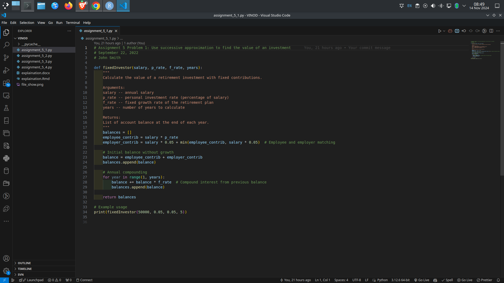
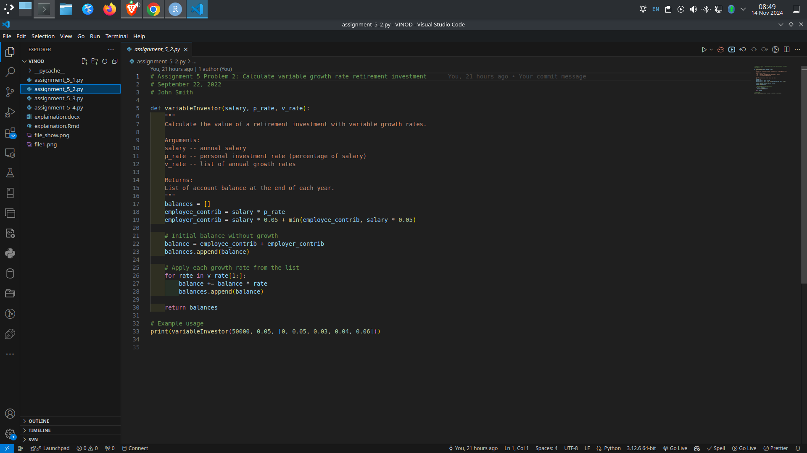
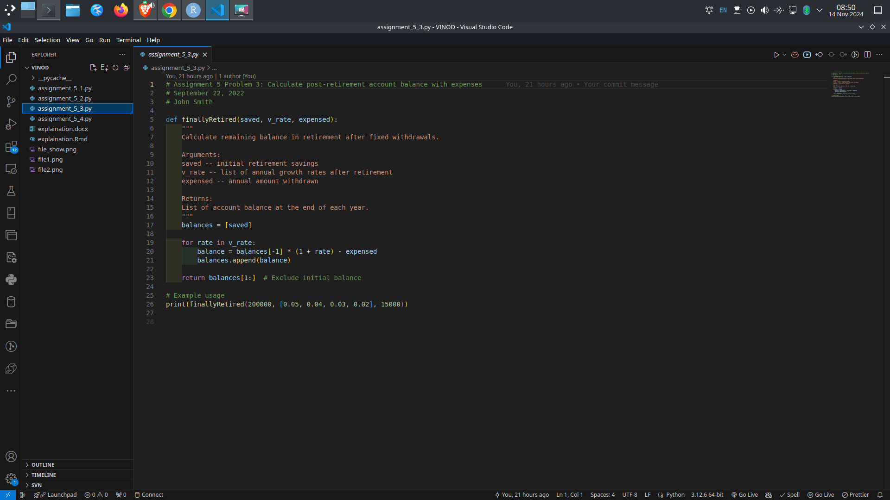
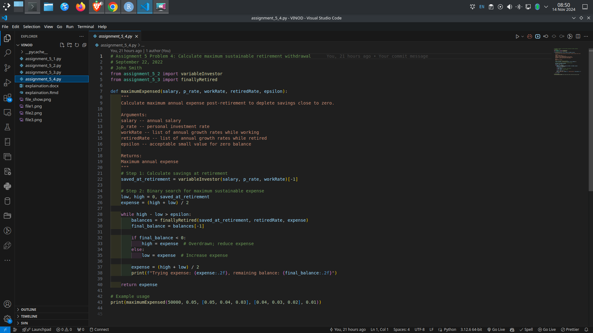

------------------------------------------------------------------------

### **File 1: `assignment_5_1.py`**

This file contains a function named `fixedInvestor`, which calculates the value of a retirement investment over a set number of years given fixed contribution and growth rates. The function takes four inputs:

-   `salary`: the employee’s annual salary,
-   `p_rate`: the employee’s investment rate as a percentage of their salary,
-   `f_rate`: the fixed growth rate of the retirement plan,
-   `years`: the number of years to calculate growth.

The function uses these inputs to calculate the year-by-year growth of the retirement fund, considering both the employee's and the employer's contributions. The function outputs a list where each element represents the total value of the retirement fund at the end of each year, compounding annually based on the given fixed growth rate.

------------------------------------------------------------------------

### **File 2: `assignment_5_2.py`**

This file contains the function `variableInvestor`, which is similar to `fixedInvestor` but allows for a variable growth rate that can change each year. Instead of a single fixed rate, `variableInvestor` accepts a list of growth rates (`v_rate`), where each list element represents the growth rate for a specific year.

The function calculates the balance at the end of each year, with the first year being a base calculation without growth. For each subsequent year, the function compounds the balance by the growth rate specified for that particular year in the `v_rate` list. The function returns a list of balances at the end of each year, reflecting the variable growth over time.

------------------------------------------------------------------------

### **File 3: `assignment_5_3.py`**

This file introduces the function `finallyRetired`, which calculates the balance of a retirement fund after retirement, assuming a fixed annual withdrawal and variable annual growth rates. The function requires three arguments:

-   `saved`: the initial amount in the retirement account at the start of retirement,
-   `v_rate`: a list of variable growth rates for each year in retirement,
-   `expensed`: the fixed amount withdrawn each year.

Starting with the initial retirement savings, the function applies each year’s growth rate, then subtracts the fixed annual withdrawal amount. It returns a list of the retirement account balance at the end of each year, showing how the account is impacted over time with variable growth rates and consistent withdrawals.

------------------------------------------------------------------------

### **File 4: `assignment_5_4.py`**

This file includes the function `maximumExpensed`, which calculates the maximum sustainable annual withdrawal amount that can be taken during retirement, such that the retirement account balance is depleted close to zero at the end. It uses binary search to find this value.

The function takes five arguments:

-   `salary`: the employee’s annual salary,
-   `p_rate`: the employee’s investment rate as a percentage of their salary,
-   `workRate`: a list of growth rates while the employee is working,
-   `retiredRate`: a list of growth rates after the employee retires,
-   `epsilon`: a small tolerance value used to determine when the account balance is close to zero.

First, the function uses `variableInvestor` to compute the total savings by the end of the employee’s career. It then uses binary search with `finallyRetired` to determine the maximum sustainable annual withdrawal that will bring the retirement balance close to zero by the end of the retirement period. This approach enables fine-tuning of the annual expense amount by finding an optimal balance between withdrawals and remaining funds.

------------------------------------------------------------------------
